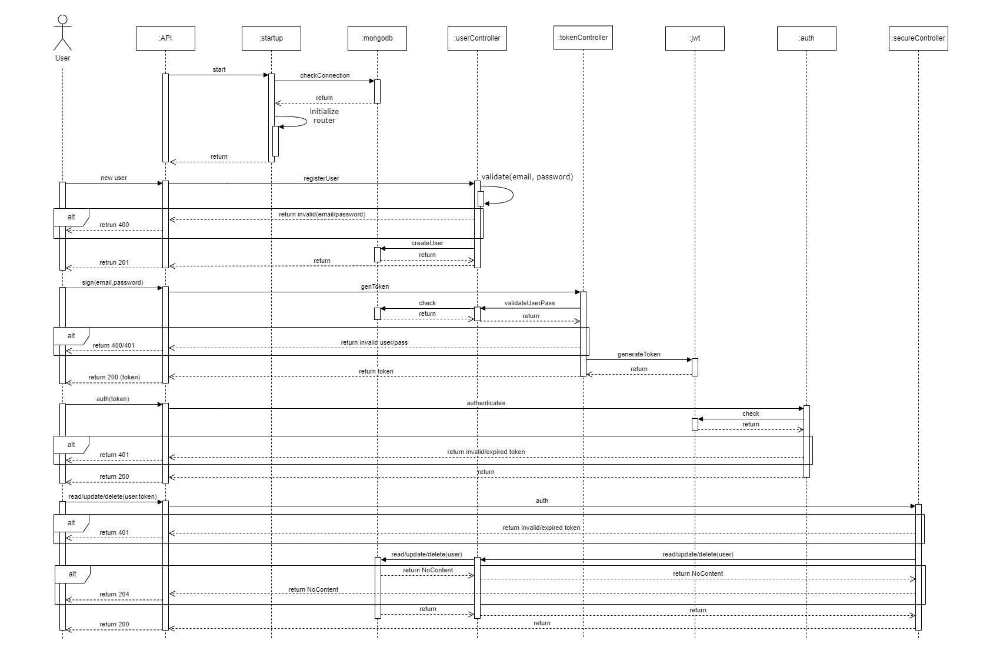
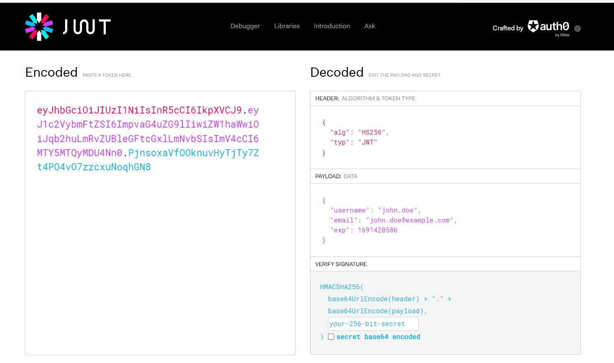

# VMA Simple User Rest API CRUD operations

This project aims to provide a basic Rest API to Create/Read/Update/Delete users using MongoDB and a security/trust acceptable level.

Requirements:
 - Keep the user information: Name, Age, Email, Password and Address
 - Use Go lang or Node.js
 - Use MongoDB or MySql
 - Key evaluation items: robustness, scalability, performance and security

## Development environment specs

Visual Studio Code (version 1.79.2)
Go lang (version go1.20.7 windows/amd64) library:
 - github.com/sirupsen/logrus v1.9.3 
 - github.com/stretchr/testify v1.8.4
 - gopkg.in/natefinch/lumberjack.v2 v2.2.1
 - github.com/golang-jwt/jwt v3.2.2+incompatible
 - github.com/gin-gonic/gin v1.9.1
 - github.com/swaggo/swag v1.16.1
 - golang.org/x/crypto v0.9.0
 - golang.org/x/net v0.10.0
 - go.mongodb.org/mongo-driver v1.12.0
Atlas MongoDB (https://cloud.mongodb.com/):
 - M0 Free cluster MongoDB 6.0
 - Replication Factor 3 Nodes
 - X.509 Certificates Authentication
 - Maximum of 500 simultaneous connections
 - Maximum of 100 databases and 500 collections
 - Able to deploy to MS Azure, AWS and GCP in a subset of regions
 - Data Transfer Limits are 10 GB in and 10 GB out per period
 - Data recovery: always takes a single daily snapshot at the same time
 - Alerts & Monitoring: Connections, Logical Size, Network and Opscounter
 - Throughput: 100 operations per second
Microsoft Windows 11 Pro x64-based PC (Version 10.0 Build 22621)
Processor: 11th Gen Intel(R) Core(TM) i7-11800H CPU @ 2.30GHz, 16 Core(s)
Total Physical Memory 32.7 GB

## 1 Configuration file

The configuration properties are simple, just the essential items that would be easily managed.

Configurable items:
 - **loggin**: logger property settings ([lumberjack](https://github.com/natefinch/lumberjack)). Each property represents as follows:
	- logFile: the file to write logs to. Backup log files will be retained in the same directory
	- maxSize: is the maximum size in megabytes of the log file before it gets rotated
	- backups: the maximum number of old log files to retain
	- maxAge: the maximum number of days to retain old log files based on the timestamp encoded in their filename. Note that a day is defined as 24 hours and may not precisely correspond to calendar days due to daylight savings, leap seconds, etc

 - **mongodb**: the mongodb Atlas cloud server properties ([mongo_driver](https://github.com/mongodb/mongo-go-driver)). We are using a Client with X509 authentication [security-x.509](https://www.mongodb.com/docs/manual/core/security-x.509/). For more detailed guidance, you can follow [quick-start](https://www.mongodb.com/docs/drivers/go/current/quick-start/#std-label-golang-quickstart):
	- serveruri: the mongoDB server address
	- replicaSet: the name of the replica that will be used
	- database: the database name 
	- caFilePath: Path to the file with either a single or bundle of certificate authorities to be considered trusted when making a TLS connection.
	- certificateKeyFilePath: Path to the client's private key file
 - **passwordStrength**: the basic password policy definition. That means all passwords must satisfy the related properties to be acceptable. 
    - minSize: the minimal acceptable size of the password. The maximum of characters is 255.
    - mustSpecialChars: define if the special characters policy is enabled. If yes, any Password must have at least one of the following symbols: ```[!"#$%&'()*+,\-./:;<=>?@[]^_{|}~]```
    - mustNumeric: define if the numeric characters policy is enabled, that means the password must have at least one number to be acceptable
    - mustLowerUpper: define if the lower and upper case characters policy is enabled. To be acceptable, the password must include at least one lower and one uppercase character
 - **ratingBoard**: new feature added to being able to see a classification regarding a system ratings suitability for specific audiences based on its content, like Motion Picture Association (MPA), Film Advisory Board (FAB) or Entertainment Software Rating Board (ESRB). The sample will use the ESRB system.

Follow the sample configuraiton available:
```json
{
    "loggin" : {
        "logFile" : "C:/VerifyMyAge/vmausers/logs/vmausers.log",
        "maxSize" : 5,
        "backups" : 5,
        "maxAge" : 30
    },
    "mongodb" : {
        "serveruri" : "mongodb+srv://cluster0.mongodb.net/",
        "replicaSet" : "atlas-shard-0",
        "database" : "vmadb",
        "caFilePath" : "C:/VerifyMyAge/certificate/X509certificate.crt",
        "certificateKeyFilePath" : "C:/VerifyMyAge/certificate/X509key.pem"
    },
    "passwordStrength" : {
        "minSize" : 8,
        "mustSpecialChars" : true,
        "mustNumeric" : true,
        "mustLowerUpper" : true
    },
    "ratingBoard" : {
        "name" : "Entertainment Software Rating Board (ESRB)",
        "website" : "https://www.esrb.org/ratings-guide/",
        "ratings" : [
            {
                "rating": "Everyone", 
                "minAge": 0, 
                "description": "Content is suitable for all ages, including minimal cartoon, fantasy or mild violence, and/or the infrequent use of mild language"
            }
          ]
    }
}
```

Only the password property has default settings. That means the system will only start if the logger and the database are adequately configurated.

## 2 Chosen architecture

The initial approach adopted was to design the behaviour to see how attached the understanding to the requirements was.

So, the sequence diagram was created as follows:


The first architecture chosen was related to a Model View Controller aiming to meet the requirements in project construction that can be scalable and that possible changes in any of the layers are made without interference in the other layers. MVC is based on the separation of data (model), user interface (view), and business logic (controller).

Using this design approach, the following segregation was applied:
 - **Model**: items related to the data manipulation, basically entity classes.
 - **View**: the user will interact through the command line interface.
 - **Controller**: the logic applied, the controller and the engine under the hood (standardizer and the parser).

With this in mind was more comfortable completing the sequence diagram. Also, thinking of providing a clean and robust code, the intent of separating each action as little as possible in each method was almost entirely achieved.

### 2.1 Security layer

The security layer was achieved by an Authentication Middleware, implementing JWT Authentication. This Middleware can secure Endpoints and allow requests that have a valid JWT Token in the Request’s Authorization Header.

These tokens are used by RESTful APIs for Authentication and Information Exchange where there is no need to manage the state of the application. According to jwt.io:  JSON Web Tokens are an open, industry-standard RFC 7519 method for representing claims securely between two parties. JWT is a good contender for securing REST APIs. Let’s see the structure of an actual JWT in action. 



A token consisted of three parts with a period: Header.Payload.Signature

The header contains the signing algorithm, such as RSA or HMAC SHA256. The payload includes the data to be exchanged. It’s usually claims sent by the server like username, or email. Sensitive data such as passwords should never be sent in through a JSON Web Token. The third part of the token, which is the Signature, is used to verify that the JWT has not been tampered with.
 
### 2.2 REST Api

It was decided to use Gin Framework because it is lightweight, well-documented, and, of course, extremely fast, they advertise itself to be 40 times faster than the typical HTTP routers and is a popular framework with over 55,000 stars on GitHub. Unlike other Go web frameworks, Gin uses a custom version of HttpRouter, which means it can navigate your API routes faster than most frameworks.

Will be used the Gin Routers and Middleware Implementation

So, the REST API contains the following controllers:
 - Token Controller: This will have one endpoint that will be used to generate the JWTs. Here, the user has to send in a list of valid email/passwords.
 - User Controller: There will be a registered user endpoint, which will be used to create new users. All other endpoints will be passed through the secured layer.
 - Rating Controller: It contains the endpoints for user rating classification and to get the rating list used.

[Swagger document](vmausers/docs/swagger.md)
 
### 2.2 database

The first idea was to use GORM because of the SQL Injection attacks. It is an ORM (object-relational mapper) library for Golang that claims to help developers build faster and make fewer errors. It works with relational databases and only supports four types of SQL databases.

Thinking about the advantages of using a NoSQL database regarding the usual Relational Database Management System (RDBMS), a basic comparison helped to clarify and proceed with the chosen one:
 - RDBMS limitations: Scalability - Users have to scale relational databases on powerful servers that are expensive and difficult to handle. To scale a relational database, it must be distributed to multiple servers. Handling tables across different servers takes a lot of work. Complexity: In SQL server’s data has to fit into tables anyhow. If your data doesn’t fit into tables, you need to design your database structure that will be complex and, again, challenging to handle.
 - NoSQL: highly and easily scalable, designed to expand horizontally and Horizontal scaling means that you scale by adding more machines into your pool of resources. Require less management. It supports many Features like automatic repair, easier data distribution, and simpler data models, making administration and tuning requirements lesser in NoSQL. No Schema or Fixed Data model. The format or data model can be changed at anytime without application disruption. And change management is a big headache in SQL. Support caching in system memory so it increases data output performance and SQL database where this has to be done using the separate infrastructure.

MongoDB is an open-source, non-relational database developed by MongoDB, Inc. MongoDB stores data as documents in a binary representation called BSON (Binary JSON). Related information is stored together for fast query access through the MongoDB query language. Fields can vary from document to document; there is no need to declare the structure of documents to the system — documents are self-describing. If a new field needs to be added to a document, then the field can be created without affecting all other documents in the collection, without updating a central system catalog, and without taking the system offline.

After a careful analysis, the decision to use MongoDB-atlas cluster free tier was taken as they provide the ability to scale and are free of management, which saves a lot of effort.
 
## 3 Future improvements

Regarding the available time and the initial requirements, a Minimal Viable Program was provided to confirm the achievements and if the path is clear regarding the development and the delivered features.

However, there are a couple of adjustments that could bring more reliability, flexibility and usage for an API like that:
 - Instead of using direct database communication, a cache feature as a Redis would be great to add more agility and performance regarding the data available.
 - Improve security using HTTPS protocol
 - 

Beyond these items, thinking of an online environment would be great to design APIs to attend this program and, to be able to process a large number of requests, like a streaming situation, maybe a message hub would be required, and another evolution of this tool to support and perform good autoscaling to attend a demand. Also, items like a Redis for caching this information and gain speed. As there is no limit to ideas, see if it's legal to store the processed information and use it with an ML to predict trends and obtain analysis regarding a topic.

# Development, thoughts and problem approaching

The first thing that I did after the project examination was to idealize an activity board.

I’ve tried to fit the project activities with my current job, my housekeeper duties, and the desired time that I'd like to spend with my daugther.

The base requirement list was created:
 - An API is written in Go to expose CRUD operations
 - A secured layer
 - Easy way to store and manipulate the Data
 
Creating an API in Go is fast and straightforward, and this task was completed pretty fast using the Gin Framework. The basic API was created as the secured layer using JWT.

The second part was to focus on the database. The intent was to use MongoDB as quickly as possible, like using a GORM-like integration. The mongoDB helper started to be created. The main objective is to make it as generic as possible, to be possible to use by another model beyond the User. After a few improvements, the Mongodb integration was completed with at least minor functions like create, read one/many, and update and delete one.

The Mongo client Middleware objective is to keep all transactions atomic (https://www.mongodb.com/blog/post/performance-best-practices-transactions-and-read-write-concerns) and to provide the data manipulation layer as easy as possible and dedicated to handling the user model transactions.

Then, the base requirements were expanded:
 - API to expose CRUD operations
  - Route logic, strategy and definition
  - what should be in the secured layer
  - keep it simple as possible
 - Secured layer
  - The JWT, simplest and fast enough
 - Database
  - Define the user model
  - Define the password policies and store them encrypted
  - Improve the user model design
 - The right method to start 
  - Make the system easy to track and Monitoring
 
